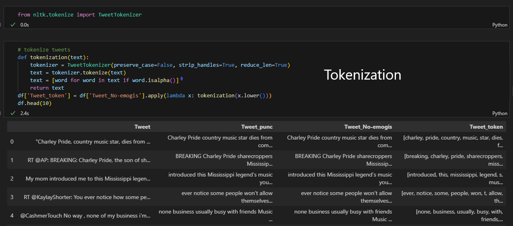
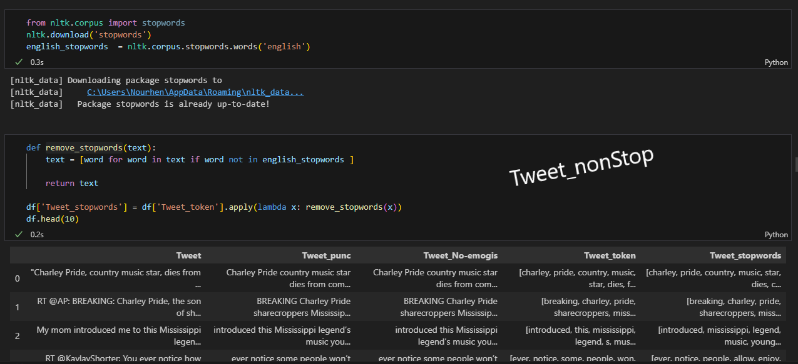
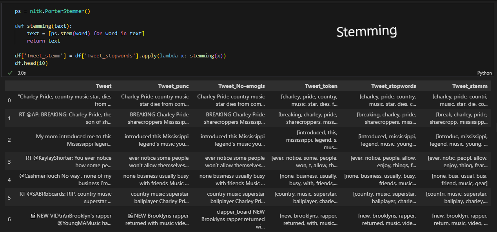
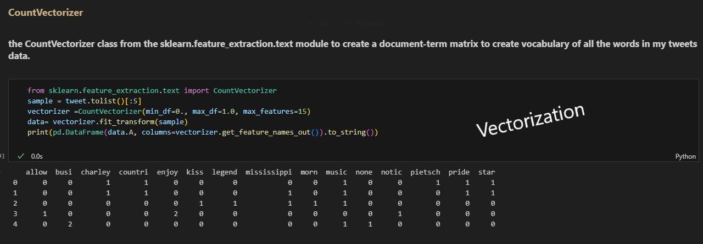
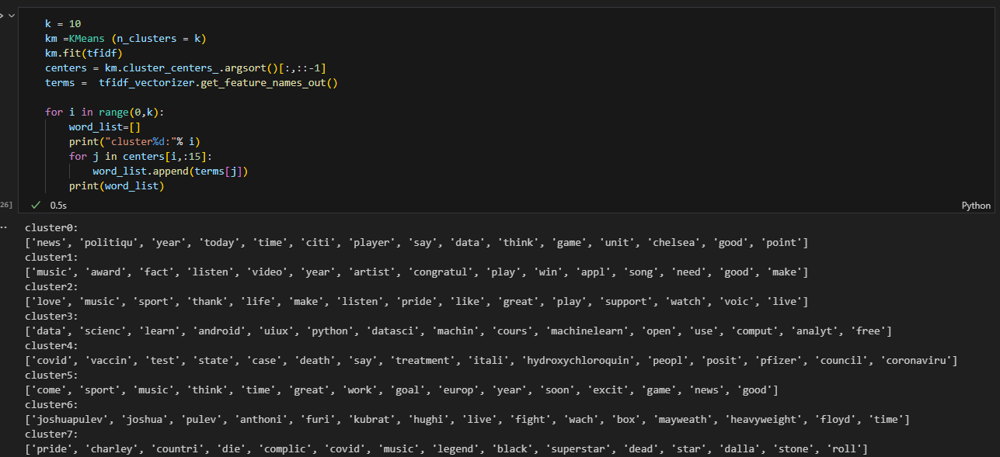

# Tweet-Extraction

# I-Objectifs:

- Maitriser l’API de twitter pour l’extraction des tweets
- Maitriser la partie NLP (natural language processing) avec NLTK en Python
- Appliquer les principes de nettoyage des données
- Classer les tweets : regrouper ensemble les tweets qui sont similaires. 

# II- Réalisation:

## Partie1: 

On va consacrer cette partie pour rélaiser nos objectifs souhaités 

Commençant tout d'abord par la préparation de l'environement du travail: 
  - Intallation de la bibliothèque twitter .
  - Téléchargement des Tweets à partir de Twitter en utilisant l’API de twitter .
  - Utilisation de la bibliothéque NLTK .
  
 Ensuite on passe à la phase la plus importante qui est la phase du pré-traitement du donnée.
 Dans cette partie on va faire le nettoyage de données telle que:
  - Dropping unnecessary columns 
  - Dropping ponctuations 
  - Dropping emoji 
  - Dropping duplicates 
  - Dropping URL
  
 Puis, on s'intéresse sur le traitement des tweets : NLP (Natural LanguageProcessing)
 Cette partie est divisé en 4 sous-parties, telle qu'on trouve :
  - Tokenization
  - Tweet_nonStop 
  - Stemming 
  - Vectorization
 
 Finalement, on termine notre projet par la Classification des tweets en utilisant le kmeans 
 
 ## Parttie2: requirements.txt
  - numpy == 1.26.2
  - matplotlib == 3.8.2
  - scipy == 3.7.2
  - seaborn == 0.13.0
  - pandas == 2.1.3
  - Ipython == 8.17.2
  - nltk == 3.8.1
  - tweepy == 3.9.0
  - wordcloud == 1.8.1

## Partie 3: Réalisation des GIF

  # GIf1: Réalisation du NLTK :
  

   # GIf1: Classification Kmeans :

# III- Conclusion:

Le traitement du langage naturel est un vaste domaine et il y a tellement plus à faire sur les données pour obtenir des informations plus précises et utiles. Cela vaut la peine d'être exploré!
